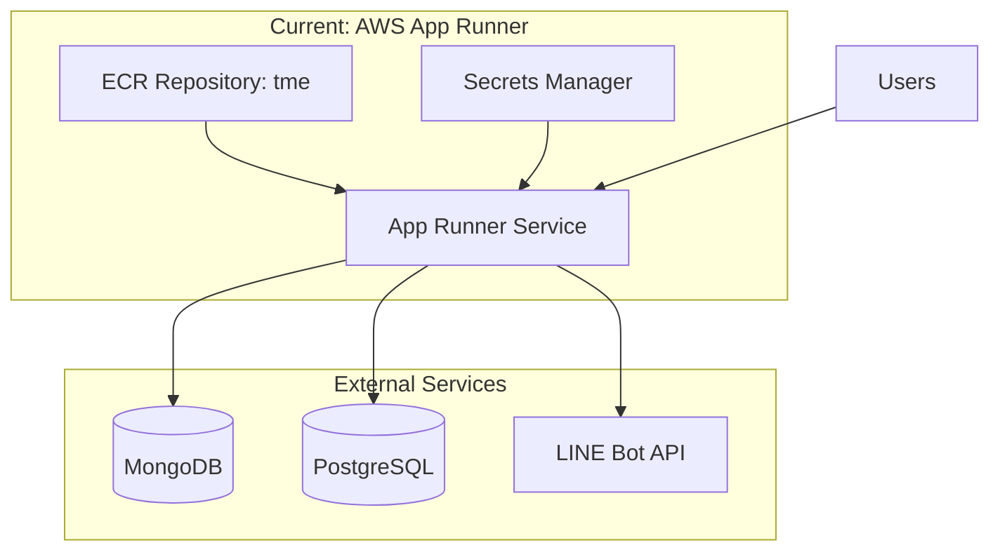
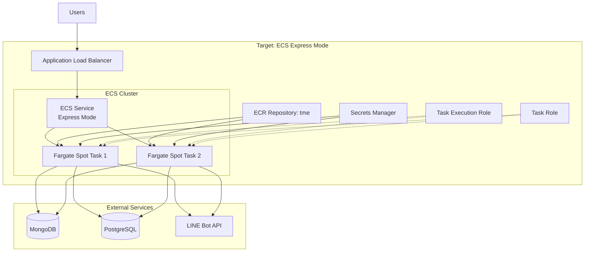

# AWS App Runner to Amazon ECS Express Mode Migration Plan

## Executive Summary

This document outlines the migration strategy from AWS App Runner to Amazon ECS Express Mode for the Tell Me Everything API application, with a focus on cost optimization through Fargate Spot instances.

## Current Architecture



### Current Configuration
- **Service**: AWS App Runner
- **Container Port**: 3030
- **Image Source**: ECR (tme repository)
- **Secrets**: AWS Secrets Manager (dev/AppRunner/tme)
- **IAM Role**: S3RoleLambda (temporary, reused from Lambda)
- **Environment**: 23 environment secrets configured

## Target Architecture



## Migration Benefits

### Cost Optimization
1. **Fargate Spot Savings**: Up to 70% cost reduction compared to on-demand Fargate
2. **Right-sizing**: Ability to fine-tune CPU/memory allocation
3. **Auto-scaling**: Scale to zero during low traffic periods
4. **No idle costs**: Pay only for running tasks

### Technical Improvements
1. **Better monitoring**: Enhanced CloudWatch metrics and Container Insights
2. **Deployment control**: Blue-green and rolling deployment strategies
3. **Network control**: VPC configuration for secure database access
4. **Load balancing**: Application Load Balancer with health checks

## Detailed Migration Steps

### Phase 1: Preparation and Setup

#### 1.1 Review Current Configuration
- Document App Runner resource usage and metrics
- Analyze traffic patterns for auto-scaling configuration
- Review current secrets and environment variables
- Identify peak and off-peak usage times

#### 1.2 Update CDK Dependencies
Update `infra/package.json`:
```json
{
  "dependencies": {
    "aws-cdk-lib": "2.248.0",
    "constructs": "^10.6.0"
  }
}
```

Remove App Runner alpha dependency:
```json
"@aws-cdk/aws-apprunner-alpha": "^2.248.0-alpha.0"
```

### Phase 2: IAM Roles Configuration

#### 2.1 Task Execution Role
Create role with minimal permissions:
- ECR image pull permissions
- CloudWatch Logs write permissions
- Secrets Manager read permissions

```typescript
const taskExecutionRole = new iam.Role(this, 'TmeTaskExecutionRole', {
  assumedBy: new iam.ServicePrincipal('ecs-tasks.amazonaws.com'),
  managedPolicies: [
    iam.ManagedPolicy.fromAwsManagedPolicyName(
      'service-role/AmazonECSTaskExecutionRolePolicy'
    ),
  ],
});

// Add Secrets Manager permissions
taskExecutionRole.addToPolicy(new iam.PolicyStatement({
  effect: iam.Effect.ALLOW,
  actions: [
    'secretsmanager:GetSecretValue',
  ],
  resources: [secrets.secretArn],
}));
```

#### 2.2 Task Role
Create role for application runtime:
- S3 access (if needed)
- SES permissions for email
- Any other application-specific permissions

### Phase 3: ECS Infrastructure

#### 3.1 ECS Cluster with Fargate Spot
```typescript
const cluster = new ecs.Cluster(this, 'TmeCluster', {
  clusterName: 'tme-cluster',
  containerInsights: true,
  enableFargateCapacityProviders: true,
});
```

#### 3.2 Task Definition
```typescript
const taskDefinition = new ecs.FargateTaskDefinition(this, 'TmeTaskDef', {
  memoryLimitMiB: 512,
  cpu: 256,
  executionRole: taskExecutionRole,
  taskRole: taskRole,
  runtimePlatform: {
    cpuArchitecture: ecs.CpuArchitecture.X86_64,
    operatingSystemFamily: ecs.OperatingSystemFamily.LINUX,
  },
});

const container = taskDefinition.addContainer('TmeContainer', {
  image: ecs.ContainerImage.fromEcrRepository(repo, imageTag.valueAsString),
  logging: ecs.LogDrivers.awsLogs({
    streamPrefix: 'tme',
    logRetention: logs.RetentionDays.ONE_WEEK,
  }),
  secrets: {
    AUTH_SECRET: ecs.Secret.fromSecretsManager(secrets, 'AUTH_SECRET'),
    DATABASE_URL: ecs.Secret.fromSecretsManager(secrets, 'DATABASE_URL'),
    // ... all other secrets
  },
  portMappings: [{
    containerPort: 3030,
    protocol: ecs.Protocol.TCP,
  }],
  healthCheck: {
    command: ['CMD-SHELL', 'curl -f http://localhost:3030/ || exit 1'],
    interval: cdk.Duration.seconds(30),
    timeout: cdk.Duration.seconds(5),
    retries: 3,
    startPeriod: cdk.Duration.seconds(60),
  },
});
```

#### 3.3 Application Load Balancer
```typescript
const alb = new elbv2.ApplicationLoadBalancer(this, 'TmeALB', {
  vpc,
  internetFacing: true,
  loadBalancerName: 'tme-alb',
});

const targetGroup = new elbv2.ApplicationTargetGroup(this, 'TmeTargetGroup', {
  vpc,
  port: 3030,
  protocol: elbv2.ApplicationProtocol.HTTP,
  targetType: elbv2.TargetType.IP,
  healthCheck: {
    path: '/',
    interval: cdk.Duration.seconds(30),
    timeout: cdk.Duration.seconds(5),
    healthyThresholdCount: 2,
    unhealthyThresholdCount: 3,
  },
  deregistrationDelay: cdk.Duration.seconds(30),
});

const listener = alb.addListener('TmeListener', {
  port: 80,
  protocol: elbv2.ApplicationProtocol.HTTP,
  defaultTargetGroups: [targetGroup],
});
```

#### 3.4 ECS Service with Fargate Spot
```typescript
const service = new ecs.FargateService(this, 'TmeService', {
  cluster,
  taskDefinition,
  serviceName: 'tme-service',
  desiredCount: 2,
  capacityProviderStrategies: [
    {
      capacityProvider: 'FARGATE_SPOT',
      weight: 4,
      base: 0,
    },
    {
      capacityProvider: 'FARGATE',
      weight: 1,
      base: 1, // Ensure at least 1 task on regular Fargate
    },
  ],
  circuitBreaker: {
    rollback: true,
  },
  enableExecuteCommand: true,
  healthCheckGracePeriod: cdk.Duration.seconds(60),
});

service.attachToApplicationTargetGroup(targetGroup);
```

### Phase 4: Auto-scaling Configuration

#### 4.1 Target Tracking Scaling
```typescript
const scaling = service.autoScaleTaskCount({
  minCapacity: 1,
  maxCapacity: 10,
});

// CPU-based scaling
scaling.scaleOnCpuUtilization('CpuScaling', {
  targetUtilizationPercent: 70,
  scaleInCooldown: cdk.Duration.seconds(60),
  scaleOutCooldown: cdk.Duration.seconds(60),
});

// Memory-based scaling
scaling.scaleOnMemoryUtilization('MemoryScaling', {
  targetUtilizationPercent: 80,
  scaleInCooldown: cdk.Duration.seconds(60),
  scaleOutCooldown: cdk.Duration.seconds(60),
});

// Request count scaling
scaling.scaleOnRequestCount('RequestScaling', {
  requestsPerTarget: 1000,
  targetGroup: targetGroup,
  scaleInCooldown: cdk.Duration.seconds(60),
  scaleOutCooldown: cdk.Duration.seconds(60),
});
```

#### 4.2 Scheduled Scaling (Optional)
```typescript
// Scale down during off-peak hours
scaling.scaleOnSchedule('ScaleDownAtNight', {
  schedule: appscaling.Schedule.cron({ hour: '22', minute: '0' }),
  minCapacity: 1,
  maxCapacity: 2,
});

// Scale up during peak hours
scaling.scaleOnSchedule('ScaleUpInMorning', {
  schedule: appscaling.Schedule.cron({ hour: '6', minute: '0' }),
  minCapacity: 2,
  maxCapacity: 10,
});
```

### Phase 5: Monitoring and Alarms

#### 5.1 CloudWatch Alarms
```typescript
// High CPU alarm
new cloudwatch.Alarm(this, 'HighCpuAlarm', {
  metric: service.metricCpuUtilization(),
  threshold: 85,
  evaluationPeriods: 2,
  alarmDescription: 'Alert when CPU exceeds 85%',
});

// High memory alarm
new cloudwatch.Alarm(this, 'HighMemoryAlarm', {
  metric: service.metricMemoryUtilization(),
  threshold: 90,
  evaluationPeriods: 2,
  alarmDescription: 'Alert when memory exceeds 90%',
});

// Target health alarm
new cloudwatch.Alarm(this, 'UnhealthyTargetAlarm', {
  metric: targetGroup.metricUnhealthyHostCount(),
  threshold: 1,
  evaluationPeriods: 2,
  alarmDescription: 'Alert when targets are unhealthy',
});
```

#### 5.2 Container Insights Dashboard
Enable Container Insights for detailed metrics:
- Task-level CPU and memory usage
- Network metrics
- Storage metrics
- Container-level performance data

### Phase 6: Deployment Strategy

#### 6.1 Blue-Green Deployment
```typescript
const service = new ecs.FargateService(this, 'TmeService', {
  // ... other config
  deploymentController: {
    type: ecs.DeploymentControllerType.CODE_DEPLOY,
  },
});
```

#### 6.2 Rolling Deployment (Recommended for cost)
```typescript
const service = new ecs.FargateService(this, 'TmeService', {
  // ... other config
  minHealthyPercent: 50,
  maxHealthyPercent: 200,
  deploymentController: {
    type: ecs.DeploymentControllerType.ECS,
  },
});
```

### Phase 7: Migration Execution

#### 7.1 Pre-Migration Checklist
- [ ] Backup current App Runner configuration
- [ ] Document current DNS settings
- [ ] Test ECS stack in staging environment
- [ ] Verify all secrets are accessible
- [ ] Confirm database connectivity from ECS tasks
- [ ] Set up monitoring dashboards
- [ ] Prepare rollback plan

#### 7.2 Migration Steps
1. Deploy ECS stack alongside App Runner (parallel run)
2. Test ECS service endpoint thoroughly
3. Update DNS to point to ALB (or use weighted routing)
4. Monitor application health and performance
5. Gradually shift traffic to ECS
6. Keep App Runner running for 24-48 hours as backup
7. Decommission App Runner after successful validation

#### 7.3 Rollback Procedure
If issues occur:
1. Revert DNS to App Runner endpoint
2. Investigate ECS issues
3. Fix and redeploy
4. Retry migration

### Phase 8: Post-Migration Optimization

#### 8.1 Cost Analysis
Monitor for 1-2 weeks:
- Fargate Spot interruption rate
- Actual CPU/memory usage
- Auto-scaling behavior
- Overall cost comparison

#### 8.2 Resource Optimization
Based on metrics:
- Adjust CPU/memory allocation
- Fine-tune auto-scaling thresholds
- Optimize Fargate Spot vs regular Fargate ratio
- Consider reserved capacity for predictable workloads

#### 8.3 Cleanup
After successful migration:
- Delete App Runner service
- Remove unused IAM roles
- Clean up old CloudWatch log groups
- Update documentation

## Cost Comparison Estimate

### Current: App Runner
- Base cost: ~$25-50/month (1 vCPU, 2GB RAM)
- Scales automatically
- Includes load balancing

### Target: ECS Express Mode with Fargate Spot
- Fargate Spot: ~$7-15/month (0.25 vCPU, 0.5GB RAM, 70% discount)
- ALB: ~$16/month (fixed cost)
- Data transfer: Variable
- **Estimated savings: 40-60% depending on usage**

### Optimization Tips
1. Use Fargate Spot for non-critical workloads
2. Scale to minimum during off-peak hours
3. Right-size CPU/memory based on actual usage
4. Use ALB request-based routing efficiently
5. Enable Container Insights only when needed

## Risk Mitigation

### Fargate Spot Interruptions
- **Risk**: Tasks may be interrupted with 2-minute notice
- **Mitigation**: 
  - Keep at least 1 task on regular Fargate (base capacity)
  - Implement graceful shutdown handling
  - Use auto-scaling to quickly replace interrupted tasks

### Database Connectivity
- **Risk**: Network configuration issues
- **Mitigation**:
  - Test connectivity thoroughly before migration
  - Use VPC endpoints for AWS services
  - Configure security groups properly

### Performance Degradation
- **Risk**: Lower resources may impact performance
- **Mitigation**:
  - Start with conservative auto-scaling thresholds
  - Monitor closely during initial weeks
  - Be ready to scale up if needed

## Success Criteria

- [ ] Application runs successfully on ECS
- [ ] All endpoints respond correctly
- [ ] Database connections stable
- [ ] Auto-scaling works as expected
- [ ] Cost reduction achieved (target: 40%+)
- [ ] No increase in error rates
- [ ] Response times within acceptable range
- [ ] Fargate Spot interruptions handled gracefully

## Timeline

- **Week 1**: Preparation and CDK updates
- **Week 2**: Infrastructure deployment and testing
- **Week 3**: Staging validation and monitoring setup
- **Week 4**: Production migration and monitoring
- **Week 5-6**: Optimization and App Runner cleanup

## Support and Documentation

### Key Resources
- [ECS Express Mode Documentation](https://docs.aws.amazon.com/AmazonECS/latest/developerguide/ecs-express.html)
- [Fargate Spot Documentation](https://docs.aws.amazon.com/AmazonECS/latest/developerguide/fargate-capacity-providers.html)
- [CDK ECS Patterns](https://docs.aws.amazon.com/cdk/api/v2/docs/aws-cdk-lib.aws_ecs_patterns-readme.html)

### Monitoring Dashboards
- ECS Service metrics
- ALB target health
- Container Insights
- Cost Explorer

## Conclusion

This migration plan provides a comprehensive approach to moving from AWS App Runner to Amazon ECS Express Mode with Fargate Spot, focusing on cost optimization while maintaining reliability. The phased approach allows for thorough testing and validation at each step, with clear rollback procedures if needed.